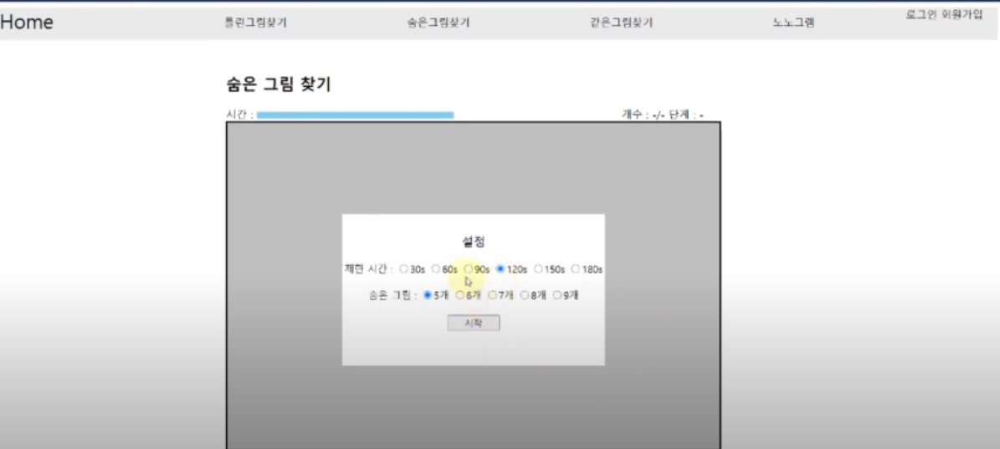
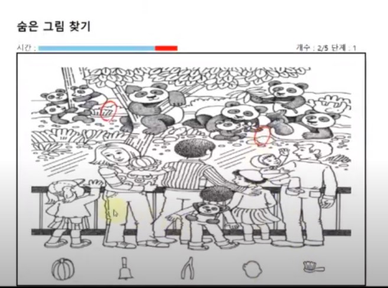
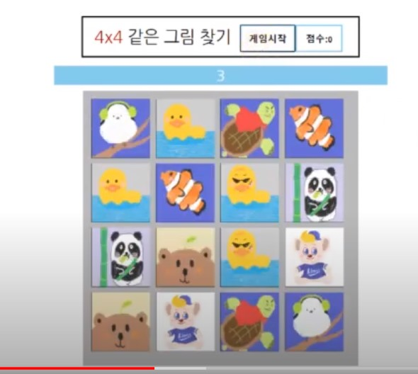
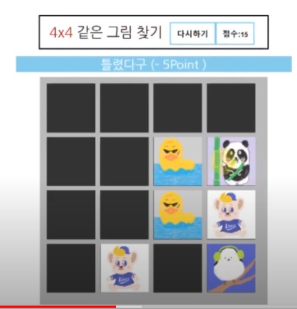
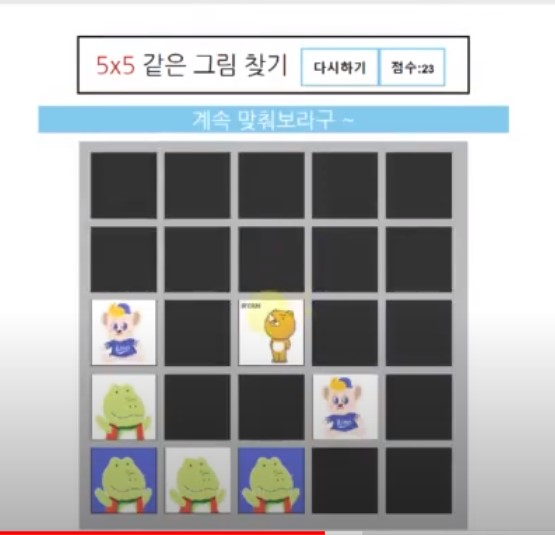
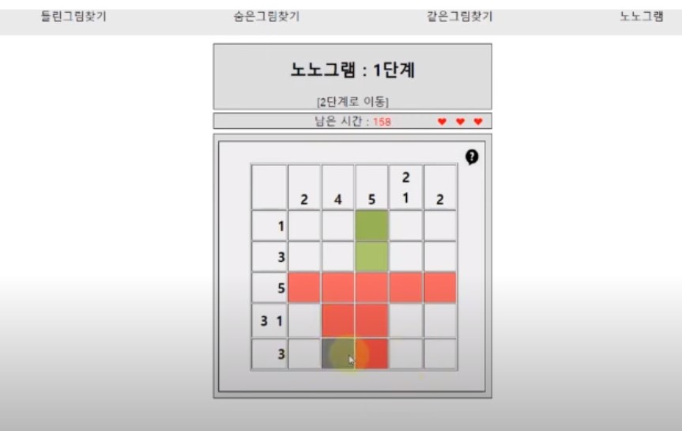
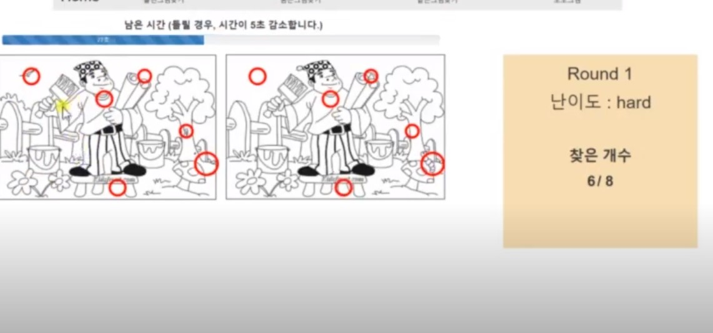
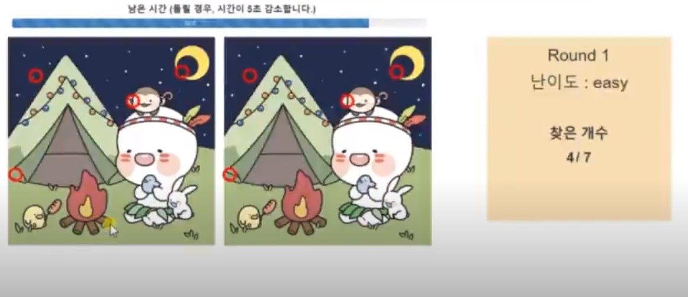

# ARCADEGAME: 고전게임 웹페이지 프로젝트

## 팀프로젝트 소개 영상(발표 영상)
[https://youtu.be/5S9DC8npByQ](https://youtu.be/5S9DC8npByQ){: }

---

## 프로젝트 결과 보고서

### 프로젝트 주제
고전게임 사이트 만들기 - 

### 팀 정보

5팀 : 
고유진(2016116742) 

김이랑(2017117034)

최민호(2016111316)

이은찬(2015110553)

## 프로젝트 제목 
고전게임 사이트 만들기

## 프로젝트 주제 

: 독창적인 요소가 들어간 고전 게임 사이트 제작익숙하고 잘 알려진 고전게임인 ‘틀린그림찾기’, ‘숨은그림찾기’, ‘같은그림찾기’, ‘노노그램’에 독창적인 요소를 추가해 웹프로그램으로 직접 구현해보았다. (추가, 수정)

## 주제 선택 동기

그간 배운 내용인 HTML, CSS, JS, JSP를 사용하되, 독창적으로 구현해 볼 수 있는 웹 사이트를 선정하기 위해 의논한 후, 고전 게임 사이트 제작이라는 주제를 선정하게 되었다.
 팀을 구성한 후 개발해보고 싶었던 주제를 의논해보았는데, 신기하게도 팀원 모두가 게임 제작과 관련된 프로젝트를 진행하고 싶어하였다. 따라서, 팀원 각각 고전게임 하나씩 개발을 맡아 ‘틀린그림찾기’, ‘숨은그림찾기’, ‘같은그림찾기’, ‘노노그램’을 구현해보기를 결정하고, 독창적인 요소를 추가하여 웹 프로그램을 개발하는 프로젝트를 진행하였다.

## 팀원 간 역할 분배

팀원 4명이 각자 게임 1개를 맡아 Javascript로 고전게임 사이트의 핵심인 게임 로직을 구현한 뒤, 홈화면, 데이터베이스, 로그인, 메뉴로 파트를 나눠 웹사이트를 완성하였다. 맡은 부분을 구현 한 후 각자 개발한 파트의 보고서 및 발표 자료를 제작하고 보고서 작성, 발표자료 작성, 동영상 자료 제작 및 소스 코드 취합을 다음과 같이 나누어 진행하였다. 

- 고유진 : 노노그램, menu.jsp, 발표 자료 제작

- 최민호 : 숨은그림찾기, 로그인, 동영상 자료 제작

- 김이랑 : 틀린그림찾기, 데이터베이스, 보고서 작성

- 이은찬 : 같은그림찾기, 웹페이지 홈화면, 소스 코드 취합 

### 기본 구조 설명

홈화면, 데이터베이스, 로그인, 메뉴

### 홈화면
 
홈화면은 사용자가 접속했을 때 가장 먼저 접하게 되는 화면이다. 간결한 디자인으로 구현하여 사용자가 원하는 메뉴를 클릭할 수 있도록 도움을 준다. 화면 상단 메뉴바를 통해 원하는 게임을 선택할 수 있다.  메뉴바에 마우스를 올리면 하위 테이블을 보여준다. 화면 ‘body’ 부분에는 소개 글과 함께 고전게임 테마에 맞는 이미지를 첨부하였다. 

### 메뉴
 
‘Home’을 클릭하면 홈화면으로 이동하고, 게임 이름을 클릭하면 클릭한 게임 페이지로 이동한다. 페이지 모듈화를 위해 따로 jsp파일로 제작되었으며, 모든 게임 코드의 가장 위에 파일을 삽입하여 게임 페이지 상단에 위치한다. 

### 로그인
로그인 기능은 사용자 데이터베이스와 세션으로 구현하여 서버와의 지속된 연결과 사용자 정보 관리를 고려하였다. 아래의 우측 그림은 회원가입을 위한 창으로, 처음 사용하는 사용자는 아이디와 비밀번호 외의 개인정보들을 입력해야 한다. 아이디와 비밀번호의 경우, 아이디 중복 검사와 유효성 검증을 통해 사용자 정보 관리의 편의와 일관성을 얻을 수 있도록 하였다. 유효성 검증에 통과된 경우 회원가입이 진행되며 해당 정보들은 서버의 데이터베이스 gameUserDB에 저장된다. 이후, 좌측 그림의 로그인 창을 통해 사용자는 로그인을 할 수 있다. 로그인의 검증을 위해 gameUserDB에서 입력된 아이디와 비밀번호와 일치되는 사용자 정보를 찾아 사용자를 확인한다. 이후, 로그아웃을 할 경우 서버에 저장된 사용자의 세션을 제거하여 사용자와 연결을 중단하도록 하였다.
      

### 데이터 베이스
데이터베이스로는 MySQL을 사용하였다. ‘DBManager’ 라는 클래스를 따로 생성하여 데이터베이스 커넥션을 관리하도록 했다. 해당 클래스에서는 JDBC_DRIVER의 이름과 DB_URL, 데이터베이스의 유저이름과 비밀번호를 관리한다. 
다른 클래스에서 ‘DBManager’ 객체를 생성하면 자동으로 데이터베이스와 커넥션이 맺어지고, 원하는 SQL 문장을 만들어서 ‘DBManager.select(String sql)’이나 ‘DBManager.update(String sql)’ 메소드로 넘겨줄 수 있다. 메소드가 실행되면 DBManager의 ResultSet 객체에 결과가 저장되고, 해당 객체를 이용해 결과를 클라이언트에게 보내줄 수 있다. 
모든 SQL 질의가 끝난 후에는 반드시 ‘DBManager.close()’ 메소드를 호출하여 커넥션을 종료하도록 해야한다.
이렇게 데이터베이스를 관리하는 클래스를 따로 만들어줌으로써 다른 클래스에서 재사용 하기에 용이하도록 구현하였다. 내꺼적기

---

## 2.게임 플레이 화면 

### 1. 숨은그림찾기

- 숨은그림 찾기의 게임 플레이 화면입니다. 룰은 숨은 그림을 제한시간 내에 찾아내면 됩니다. 게임 시작시 맨 처음 설정에서 제한시간과 난이도(숨은 그림)을 조절할 수 있습니다. 

자세한 플레이 화면은 상단 **[프로젝트 소개 영상]** 을 참조해주시면 좋겠습니다.

### 2. 같은그림찾기

- 같은그림찾기의 게임 플레이 화면입니다. 룰은 같은 그림을 찾아가면서 게임을 클리어하면 됩니다. 4X4 , 5X5 6X6을 설정하여 플레이 할 수 있습니다. 

자세한 플레이 화면은 상단 **[프로젝트 소개 영상]** 을 참조해주시면 좋겠습니다.

### 3. 노노그램

- 노노그램의 게임 플레이 화면입니다. 노노그램은 행렬로 구성된 화면의 숫자정보를 보고 제한된 기회 안에
올바른 픽셀을 맞춰가면서 마지막 그림이 무엇일지를 맞추는 게임입니다. 

자세한 플레이 화면은 상단 **[프로젝트 소개 영상]** 을 참조해주시면 좋겠습니다. 

### 4. 틀린그림찾기

- 틀린그림찾기의 플레이 화면입니다. 숨은그림찾기의 룰은 두개의 그림 중에 다른 부분을 제한시간 안에 찾아가는 게임입니다. 

자세한 플레이 화면은 상단 **[프로젝트 소개 영상]** 을 참조해주시면 좋겠습니다. 

---

## 3. 코드 

[코드 폴더 링크](https://github.com/purang2/ArcadeGame_AdvWebProgramming/tree/main/Arcade_TermProject/WebContent)

---

## 수업을 통해 알게 된 점 

- JS(자바스크립트)와 JSP의 차이:

언어를 배우다보면 Java, JavaScript, JSP등 헷갈릴텐데요.

특히 JavaScript와 JSP는 같은 의미로 생각하시는 분들이 많을 것 같아요.

(저도 그렇게 생각했답니다.....)

JSP는 서버에서 자원들(코드)을 사용하는 것이고 JavaScript는 클라이언트에서 자원들(코드)을 사용합니다.

기존의 Java언어를 사용하는 것에는 동일하지만

JSP는 웹 서버에서 실행되는 .JSP파일이라면,

JavaScipt는 <script>태그를 사용하여 표현하죠. 사용자의 웹 화면인 .HTML파일 입니다.

다시 말해 서버에서 실행되어 결과를 사용자에게 보여주는 방식이 JSP이고 

자바스크립트는 클라이언트(사용자)의 웹 브라우저 화면에 실행되어지는 방식입니다.

**JSP는 서버 언어!**

**JavaScript는 클라이언트 언어!**

